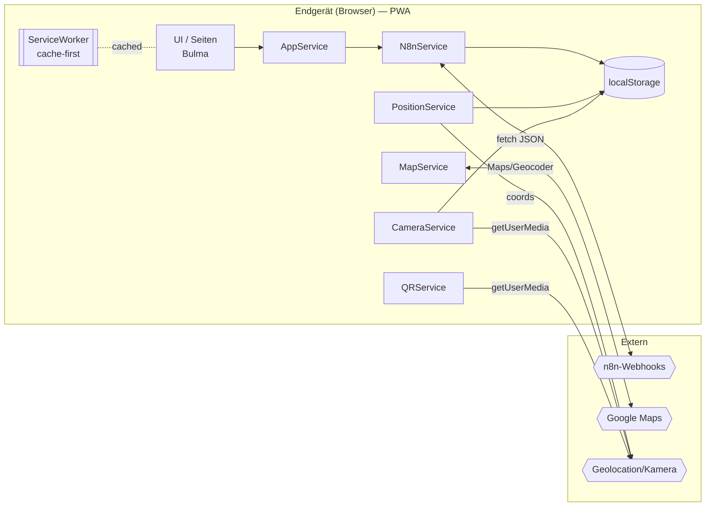
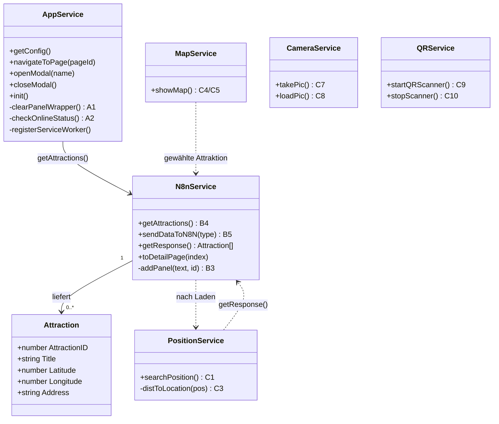

# ARCHITECTURE.md — Systemaufbau (Touristik Guide)

> **Pflichtlektüre vor jeder Codeänderung.**
> Gefüllt für die LB3-Beispiel-PWA „Touristik Guide". Für ein **eigenes** Projekt die
> Inhalte ersetzen (Struktur + Diagramm-Konventionen beibehalten).
> **Änderungen nur nach Teamabsprache.**

---

## Projektbeschreibung

**Projekt:** Touristik Guide (Progressive Web App)
**Kurzbeschreibung:** Mobile, offline-fähige PWA, mit der Tourist:innen Sehenswürdigkeiten
entdecken (Liste + Details), Entfernung/Karte sehen, Bewertungen abgeben sowie Fotos und
QR-Codes nutzen. Backend ist ein n8n-Workflow (Low-Code).
**Demo-Ziel:** Lauffähige, installierbare PWA; kritischer Pfad `00 → 01 → 02` steht (App läuft
offline, Attraktionen aus n8n sichtbar, Bewertung sendbar).

---

## Technologiestack

| Schicht | Technologie | Begründung |
|---|---|---|
| Frontend | HTML + **Bulma-CSS** + Vanilla-JS (IIFE-Module) | Kein Build, kein npm — direkt im Browser lauffähig |
| „Backend" | **n8n-Webhooks** (Low-Code) | Kein eigener Server nötig; Workflows statt Code |
| Datenhaltung | n8n liefert JSON; `localStorage` (Position, Foto, letzte Daten) | Ausreichend für die Übung; keine DB |
| PWA | ServiceWorker (cache-first) + `manifest.json` | Offline-Fähigkeit + „Add to Homescreen" |
| Tests/Abnahme | **Browser-Verifikation** (DevTools); optional vitest für reine Logik | Statische PWA hat keinen Test-Runner — s. `docs/setup.md` |
| Externe Dienste | **Google Maps** (Karte), **jsQR** (QR) | Karte/Marker bzw. QR-Erkennung |
| Deployment | Statisch (Webserver/SFTP); lokal via **Live Server** (`http://localhost`) | Secure context nötig (ServiceWorker/Kamera/Geo) |

---

## Komponentenstruktur

```
ki-projekt-template/
├── requirements/          Anforderungen + Feature-Doku (00–06, 99-example)
├── stufen/                PWA-Code in Stufen A/B/C (siehe stufen/README.md)
│   └── <A|B|C>/
│       ├── index.html         Bulma-UI: Start, Liste, Detail, Karte, Foto, QR
│       ├── manifest.json      PWA-Manifest
│       ├── serviceworker.js   install/activate/fetch (cache-first)
│       └── assets/js/
│           ├── app.js         AppService  — Navigation, Modals, SW-Registrierung
│           ├── n8n.js         N8nService  — Attraktionen laden + Daten senden
│           ├── position.js    PositionService — Geolocation + Entfernung
│           ├── map.js         MapService  — Google Maps
│           ├── camera.js      CameraService — Foto
│           └── qr.js          QRService   — QR-Scan
└── docs/                  setup, diagramme, lehrkonzept, github-classroom
```

**Komponenten-/Datenfluss (Mermaid):** Konvention → [`docs/diagramme.md`](docs/diagramme.md) Abschnitt 6.



---

## n8n-Endpunkte (statt klassischer API)

Basis: `CONFIG.baseUrl` (z. B. `https://n8n.edu-space.de/webhook/`) — in Aufgabe **B2** anpassen.

| Methode | Endpoint (`CONFIG.endpoints`) | Beschreibung |
|---|---|---|
| GET | `get-attractions` | Liste der Attraktionen (JSON-Array) |
| POST | `add-comment` | Bewertung/Kommentar speichern (`comment`) |
| POST | `app-review-email` | Bewertung per E-Mail (`email`, optional D) |
| POST | `add-attraction` | Neue Attraktion anlegen (`attraction`, optional D) |
| POST | `chat-attraction` | Chat-Anfrage (`chat`, optional D) |

---

## Datenmodell

**Attraktion** (Feld­namen wie vom n8n-Workflow geliefert):

```
Attraction:
  - AttractionID: number
  - Title: string
  - Description: string
  - Latitude: number
  - Longitude: number
  - Address: string
  - Telephone: string
  - Email: string
  - URL: string
```

**localStorage-Schlüssel:** `dataFromN8N` (letzte Liste), `currentLat`/`currentLng` (Position),
`locationID` (gewählte Attraktion), `FotoPfad` (letztes Foto).

**Services als Klassendiagramm (Mermaid):** Konvention → [`docs/diagramme.md`](docs/diagramme.md) Abschnitt 2.



---

## Architekturentscheidungen (ADRs)

### ADR-01: Statische Vanilla-PWA + n8n statt eigenem Backend

**Datum:** 2026-07-01 · **Status:** akzeptiert
**Kontext:** LB3-Übung soll ohne Build-Toolchain/eigenen Server auskommen.
**Entscheidung:** Frontend als statische Vanilla-PWA (Bulma); „Backend" als n8n-Webhooks.
**Konsequenzen:** Kein npm/Build; einfache Auslieferung; dafür Abhängigkeit von n8n und
Browser-APIs (ServiceWorker, Geolocation, Kamera).

### ADR-02: Browser-Verifikation statt Test-Runner

**Datum:** 2026-07-01 · **Status:** akzeptiert
**Kontext:** Der Code nutzt Browser-APIs + globales IIFE-Muster — in Node/jsdom nicht ohne
Umbau testbar; ServiceWorker gar nicht.
**Entscheidung:** „Fertig"-Nachweis über Browser-DevTools (Application/Cache/Offline). Reine
Logik optional mit vitest. Details: `docs/setup.md` → „Verifikation: PWA vs. Test-Stack".
**Konsequenzen:** Kein automatisches Autograding per `npm test` für die PWA.

---

## Bekannte Einschränkungen

- Kein eigenes Backend/keine DB — Datenanbindung nur über n8n-Webhooks
- Google Maps benötigt Netz + API-Key (keine Offline-Karten)
- Fotos nur flüchtig (Object-URL/localStorage), kein Server-Upload im Kernumfang
- Läuft nur im secure context (`http://localhost` / HTTPS), nicht per `file://`
