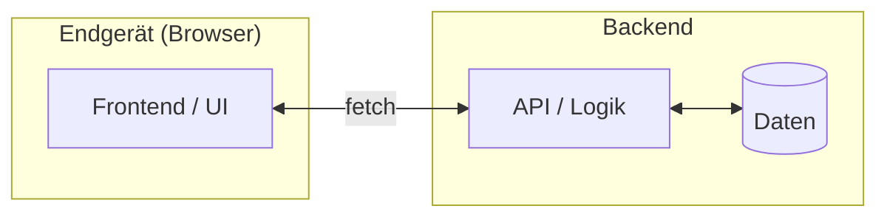

# ARCHITECTURE.md — Systemaufbau

> **Pflichtlektüre vor jeder Codeänderung.**  
> Diese Datei beschreibt, wie das System aufgebaut ist und welche Entscheidungen das Team getroffen hat.  
> **Änderungen nur nach Teamabsprache.**

---

## Projektbeschreibung

**Projekt:** [HIER EINTRAGEN]  
**Kurzbeschreibung:** [Was tut die Anwendung? Für wen? Welches Problem löst sie?]  
**Demo-Ziel:** [Was soll am Ende der Lehrveranstaltung lauffähig sein?]

---

## Technologiestack

| Schicht | Technologie | Begründung |
|---|---|---|
| Frontend | [z.B. HTML/CSS, React, Vue, Lit] | [Warum?] |
| Backend | [z.B. Node.js, Python Flask, Express] | [Warum?] |
| Datenbank | [z.B. JSON-Dateien, SQLite, PostgreSQL] | [Warum?] |
| Tests | [z.B. Vitest, Jest, pytest] | [Warum?] |
| Deployment | [z.B. lokal, Vercel, Docker] | [Warum?] |

> **Empfehlung für Einsteiger:** Einfach starten — JSON-Dateien als Datenbank, reines HTML/JS oder ein leichtgewichtiges Framework. Komplexität entsteht von selbst.

---

## Komponentenstruktur

```
[HIER: Verzeichnisbaum eurer Anwendung eintragen]

Beispiel:
project-root/
├── frontend/
│   ├── index.html
│   └── src/
│       ├── components/    ← Wiederverwendbare UI-Bausteine
│       └── pages/         ← Einzelne Ansichten
├── backend/
│   ├── server.js          ← Einstiegspunkt
│   ├── routes/            ← API-Endpunkte
│   └── data/              ← JSON-Dateien (statt Datenbank)
└── shared/
    └── types.js           ← Gemeinsame Datentypen (NUR nach Absprache ändern!)
```

**Komponenten-/Datenfluss (Mermaid):** Konvention → [`docs/diagramme.md`](docs/diagramme.md) Abschnitt 6.



---

## API-Endpunkte

| Methode | Pfad | Beschreibung |
|---|---|---|
| GET | `/api/[ressource]` | [Was wird zurückgegeben?] |
| POST | `/api/[ressource]` | [Was wird angelegt?] |
| PATCH | `/api/[ressource]/:id` | [Was wird geändert?] |

> Neue Endpunkte zuerst hier eintragen, dann umsetzen. Verhindert Missverständnisse im Team.

---

## Datenmodell

```
[HIER: Wichtigste Entitäten und ihre Felder]

Beispiel:
User:
  - id: string (UUID)
  - name: string
  - email: string

Booking:
  - id: string
  - userId: string      ← Verweis auf User
  - date: string (ISO 8601)
  - status: "open" | "confirmed" | "cancelled"
```

**Als Klassendiagramm (Mermaid):** Konvention → [`docs/diagramme.md`](docs/diagramme.md) Abschnitt 2.

```mermaid
classDiagram
    class [Entität1] {
        +string id
        +string name
    }
    class [Entität2] {
        +string id
    }
    [Entität1] "1" --> "0..*" [Entität2] : [Beziehung]
```

> Das Datenmodell betrifft alle Features gleichzeitig — Änderungen nur nach Teamabsprache.

---

## Architekturentscheidungen (ADRs)

### ADR-01: [Titel der Entscheidung]

**Datum:** [DATUM]  
**Status:** akzeptiert

**Kontext:** [Welches Problem haben wir gelöst?]  
**Entscheidung:** [Was haben wir entschieden?]  
**Konsequenzen:** [Was bedeutet das? Was akzeptieren wir damit?]

---

## Bekannte Einschränkungen

- [z.B. „Keine Anmeldung — Authentifizierung ist für den Umfang nicht relevant"]
- [z.B. „Daten nur im Arbeitsspeicher — reicht für die Demo"]
- [z.B. „Kein Deployment — läuft nur lokal"]
