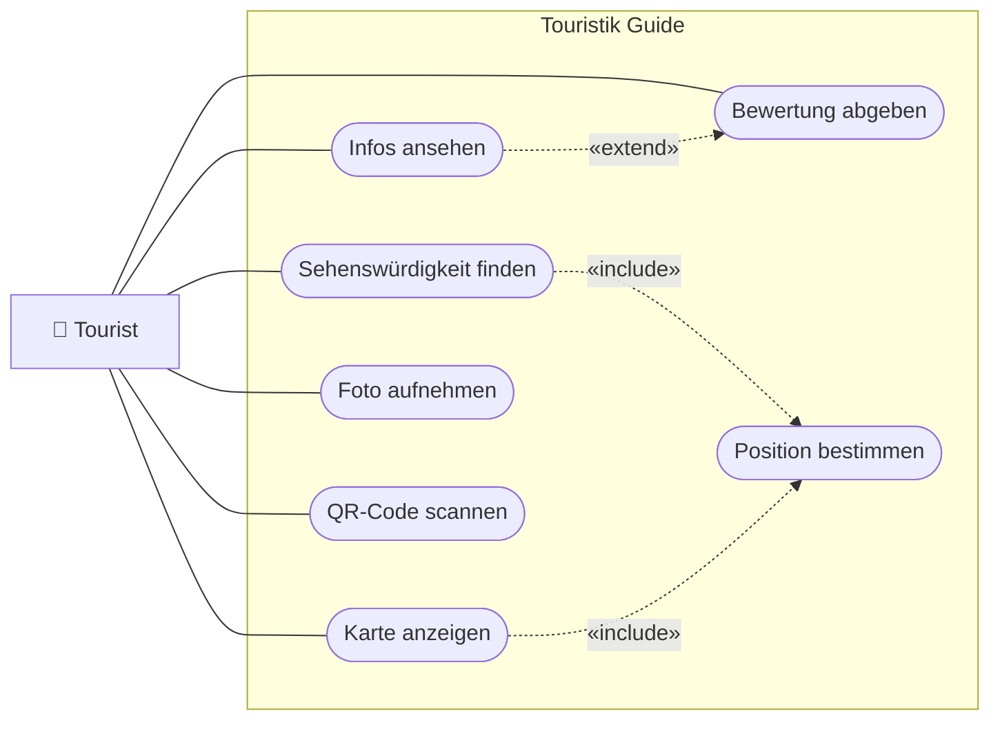
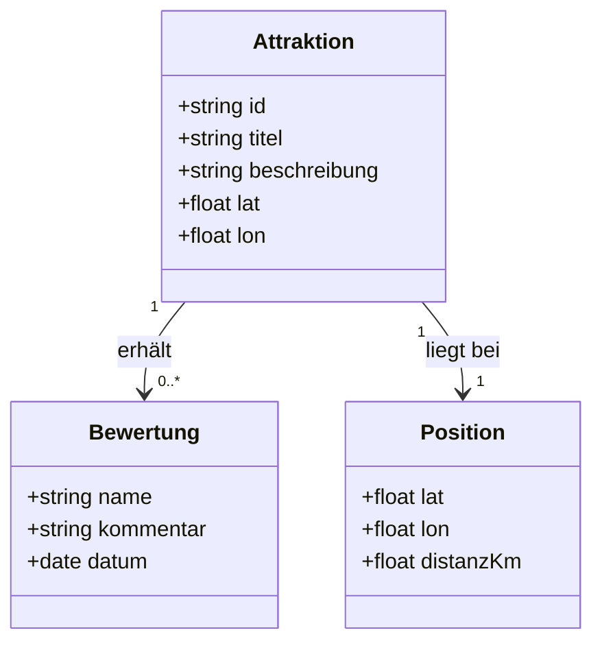
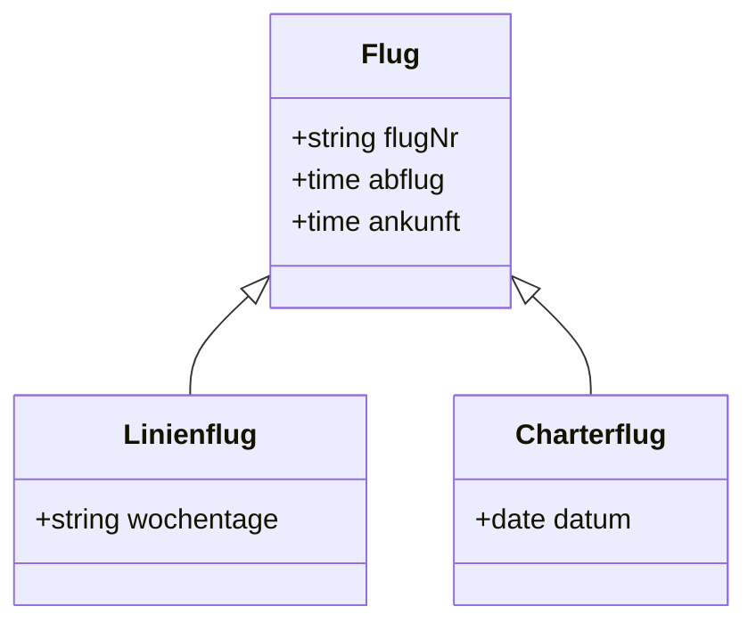
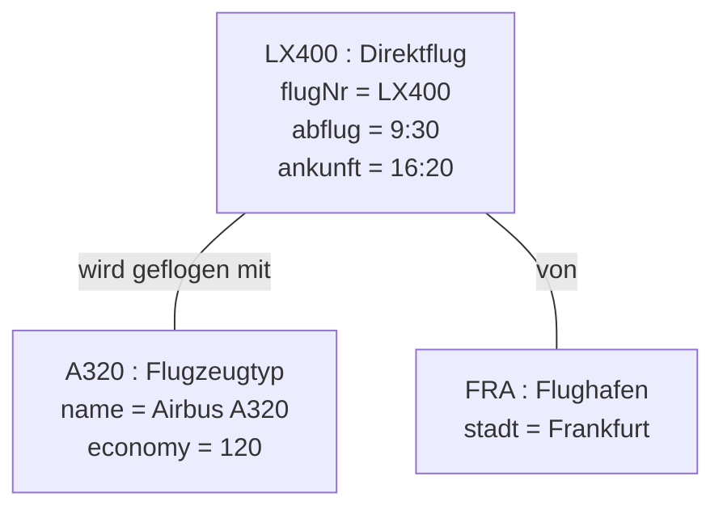
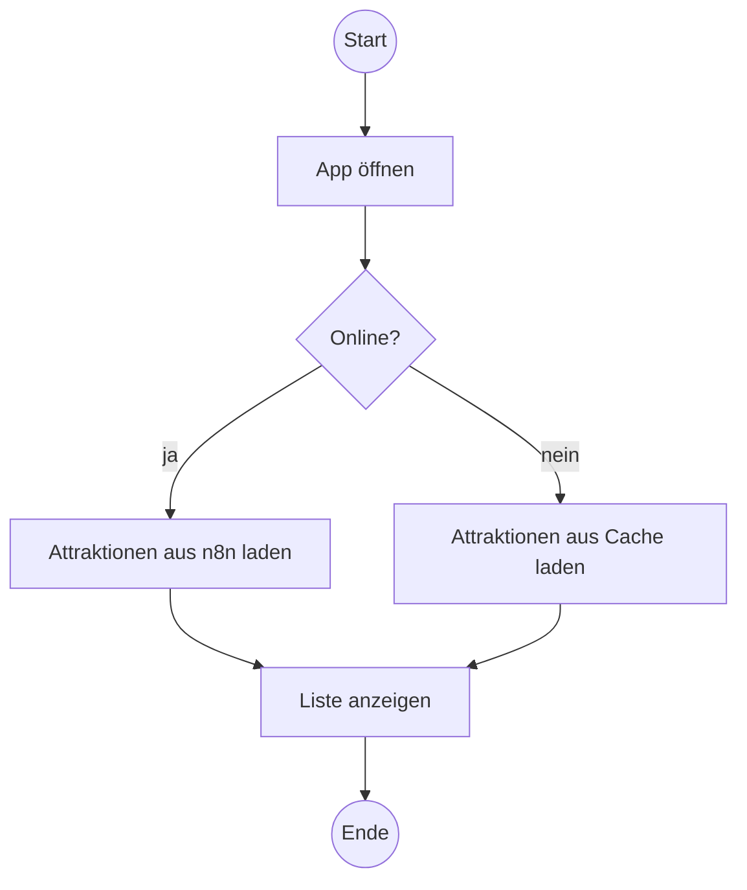
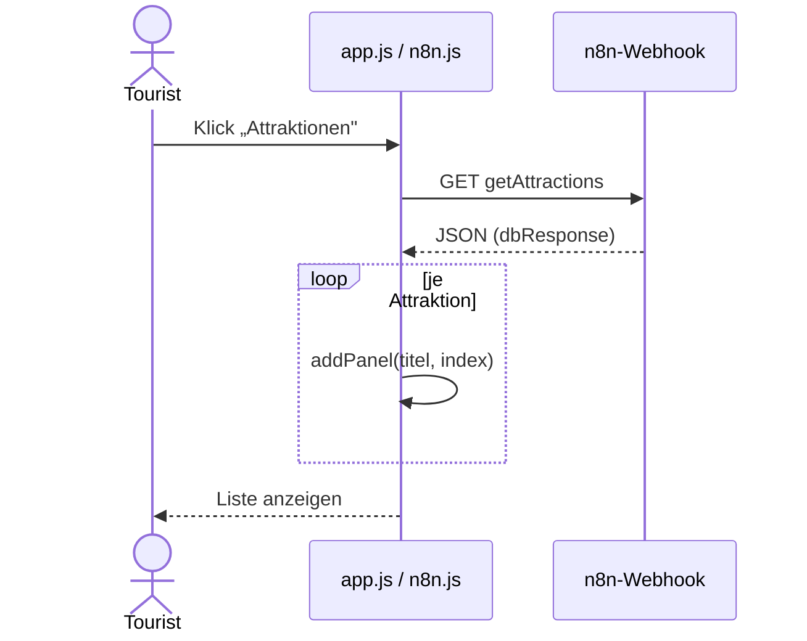
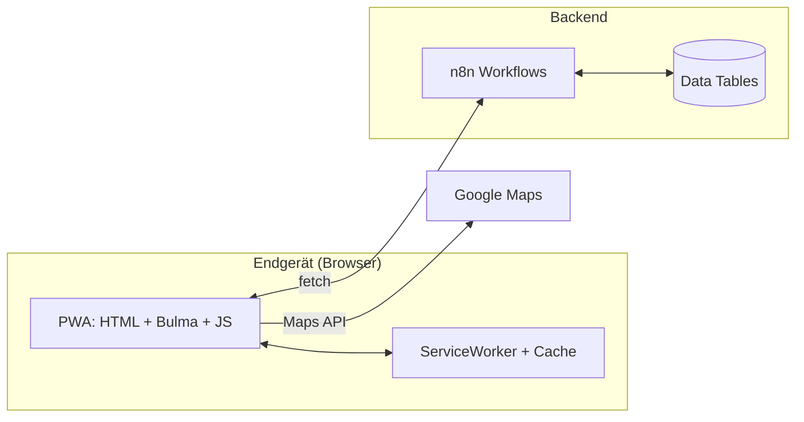

<!-- Hinweis: Diese Datei legt die Diagramm-Konventionen für das Projekt fest. Alle
     Diagramme werden in Mermaid notiert, weil GitHub, VS Code und die meisten
     Markdown-Tools Mermaid OHNE Zusatzsoftware rendern. So bleibt das Projekt
     werkzeugunabhängig, und Diagramm-Änderungen erscheinen als lesbarer Diff im
     Pull Request (leichtere Reviews/Korrektur). Die Beispiele nutzen die App
     „Touristik Guide" als roten Faden. -->

# Diagramm-Konventionen (Mermaid)

Alle Modelle in diesem Projekt werden als **Mermaid** im Markdown notiert. Vorteile:

- **Rendert nativ** auf GitHub, in VS Code (Extension „Markdown Preview Mermaid Support")
  und in den meisten Markdown-Tools — keine zusätzliche Toolchain.
- **Klartext im Repo** → Diagramm-Änderungen sind im Pull Request als Diff sichtbar.
- **Eine Sprache für alles** → einheitlich zu lesen, zu pflegen und zu korrigieren.

> **Tipp:** Den KI-Agenten kann man Diagramme direkt erzeugen lassen, z. B.:
> *„Erzeuge ein Mermaid-UseCase-Diagramm nach der Konvention aus `docs/diagramme.md`
> für die Use Cases in `requirements/REQUIREMENTS.md`."*

Wo welches Diagramm hingehört:

| Diagramm | Mermaid-Typ | Gehört in |
|---|---|---|
| UseCase-Diagramm (UCD) | `flowchart` (Konvention unten) | `USERSTORY.md` |
| Klassendiagramm | `classDiagram` | `ARCHITECTURE.md` |
| Objektdiagramm | `flowchart` (Konvention unten) | je Feature, wo hilfreich |
| Aktivitätsdiagramm | `flowchart` | `USERSTORY.md` / `FEATURE.md` |
| Sequenzdiagramm | `sequenceDiagram` | `IMPLEMENTATION.md` |
| Komponenten-/Architektur | `flowchart` | `ARCHITECTURE.md` |

---

## 1. UseCase-Diagramm (UCD)

<!-- Hinweis: Mermaid hat KEINEN nativen UCD-Typ. Wir bilden ihn als flowchart nach.
     Die Konvention unten ersetzt die UML-Notation 1:1 in der Aussage. -->

**Konvention:**
- **Akteur:** Rechteck mit 👤-Präfix — `akteur["👤 Name"]`
- **Use Case:** Stadion-Form (abgerundet) — `uc(["Use Case"])`
- **Systemgrenze:** `subgraph` mit dem Systemnamen
- **Assoziation** (Akteur ↔ Use Case): durchgezogene Linie `---`
- **«include»:** gestrichelter Pfeil mit Label `-. «include» .->`
- **«extend»:** gestrichelter Pfeil mit Label `-. «extend» .->`

> Lesehilfe: „Sehenswürdigkeit finden" und „Karte anzeigen" brauchen immer die
> Positionsbestimmung (`«include»`). „Infos ansehen" *kann* um „Bewertung abgeben"
> erweitert werden (`«extend»`), muss aber nicht.

---

## 2. Klassendiagramm

<!-- Hinweis: classDiagram ist nativ. Multiplizitäten, Vererbung und Assoziationen
     werden direkt unterstützt. -->

**Vererbung** (Verallgemeinerung/Spezialisierung) wie im LB3-Beispiel:

---

## 3. Objektdiagramm

<!-- Hinweis: Mermaid hat keinen Objektdiagramm-Typ. Konvention: flowchart-Knoten,
     deren Beschriftung "objekt : Klasse" plus Attribut=Wert enthält. -->

**Konvention:** Knotenbeschriftung `objekt : Klasse` (unterstrichen-Ersatz: Doppelpunkt),
darunter `attribut = wert`. Verknüpfungen als beschriftete Linien.

---

## 4. Aktivitätsdiagramm

<!-- Hinweis: Als flowchart. Start/Ende rund, Entscheidungen als Raute. -->

---

## 5. Sequenzdiagramm

<!-- Hinweis: sequenceDiagram ist nativ. Ideal, um Funktionsabläufe in
     IMPLEMENTATION.md zu dokumentieren (LB3 nutzt mehrere davon). -->

Beispiel: Laden der Attraktionen (`btnToAttraction` → `getAttractions`):

---

## 6. Komponenten-/Architekturdiagramm

<!-- Hinweis: Als flowchart. Gehört in ARCHITECTURE.md, zeigt Bausteine + Datenfluss. -->

