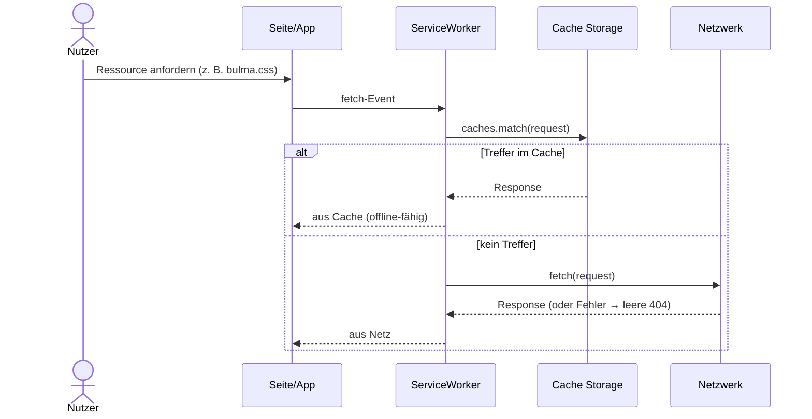

# IMPLEMENTATION.md — Feature 00: Grundgerüst (App-Shell)

> **Für den KI-Agenten:** Arbeite diese Datei Schritt für Schritt ab.
> Hake jeden erledigten Schritt mit `[x]` ab. Aktualisiere `BACKLOG.md` am Ende.
> Bei Unterbrechung: Die nächste Sitzung beginnt mit dem Lesen dieser Datei.

**Ziel:** Lauffähige, offline- und installierbare PWA-Hülle (Navigation, Online-Status, ServiceWorker-Cache).
**Abhängigkeit:** — (Startpunkt)
**Verantwortlich:** [Name]
**Branch:** `feature/00-foundation`

---

## Technische Übersicht

**Stack:** statische Vanilla-PWA — HTML + Bulma-CSS + Vanilla-JS. **Kein Build, kein npm.**
Daten kommen erst ab Feature `01` über n8n-Webhooks.

**Lokal starten:** über einen Server auf `http://localhost`, **nicht** per Doppelklick
(`file://` → der ServiceWorker registriert sich dort nicht). Am einfachsten in VS Code die
Erweiterung **„Live Server"** („Go Live") — kein Node nötig, identisch unter Windows/macOS;
Alternativen `python3 -m http.server` / `npx serve`. Schritt-für-Schritt + DevTools-Prüfung:
[`docs/setup.md`](../../docs/setup.md) → „App lokal starten & prüfen".

**Betroffene Dateien:**
- Anpassen: `assets/js/app.js` (`AppService`) — Marker **A1**, **A2**
- Anpassen: `serviceworker.js` — Marker **A3**, **A4**, **A5** + `PATH_ROOT`
- Vorgegeben (nicht ändern): `index.html`, `manifest.json`, `assets/css/bulma.css`

**Marker-Konvention:** Jede Aufgabe steht als `// ToDo <Label>:`-Auftrag über einem
`//------`-Rahmen mit `console.log("ToDo: …")`-Stub. Funktionssignatur **erhalten**, nur
den Rumpf umsetzen. (Hintergrund: `STAGES.md` im Musterlösungs-Repo, Abschnitt 4.)

**Verifikation:** Diese PWA hat keinen Test-Runner — geprüft wird **im Browser** über die
DevTools (Konsole, Tab *Application* → *Service Workers* / *Cache Storage*, Offline-Schalter).
Das ersetzt hier den „grünen Test" des TDD-Zyklus.

**ServiceWorker-Fetch als Sequenzdiagramm (Mermaid):** Konvention → [`docs/diagramme.md`](../../docs/diagramme.md) Abschnitt 5.



---

## Task 1: A1 — `clearPanelWrapper()` (app.js)

**Auftrag (Original-Marker):** „loesche alle childNodes des Wrappers, sie werden bei
`getAttractions()` neu hinzugefuegt." Wird vor dem Wechsel zur Attraktionsliste (`btnToAttraction`) aufgerufen.

- [ ] **Schritt 1: Marker finden** — `assets/js/app.js`, Funktion `clearPanelWrapper()` (enthält `console.log("ToDo: A1")`).
- [ ] **Schritt 2: Umsetzen** — alle Kindknoten von `#panelWrapper` entfernen (Schleife über `firstChild`, `removeChild`). Signatur unverändert.
- [ ] **Schritt 3: Im Browser prüfen** — App laden, „Zu den Attraktionen" klicken → der Listenbereich ist vor dem Neuaufbau leer, keine Konsolenfehler.
- [ ] **Schritt 4: Commit** — `git commit -m "feat(foundation): A1 clearPanelWrapper umgesetzt"`

---

## Task 2: A2 — `checkOnlineStatus()` (app.js)

**Auftrag (Original-Marker):** „Pruefen ob on- oder offline." Ist in `init()` an die Events
`online`/`offline` gebunden und wird initial einmal aufgerufen.

- [ ] **Schritt 1: Marker finden** — `assets/js/app.js`, Funktion `checkOnlineStatus()` (`console.log("ToDo: A2")`).
- [ ] **Schritt 2: Umsetzen** — Text des Elements `#status` auf `navigator.onLine ? 'online' : 'offline'` setzen.
- [ ] **Schritt 3: Im Browser prüfen** — DevTools → *Network* → *Offline* umschalten; die Statusanzeige wechselt entsprechend.
- [ ] **Schritt 4: Commit** — `git commit -m "feat(foundation): A2 Online-/Offline-Status"`

---

## Task 3: A3–A5 + PATH_ROOT — ServiceWorker (serviceworker.js)

> Reihenfolge wichtig: erst `PATH_ROOT` setzen, dann install → activate → fetch.
> Nach jeder Änderung den ServiceWorker in DevTools → *Application* → *Service Workers*
> per *Update*/*Unregister* neu laden (sonst greift die alte Version).

- [ ] **Schritt 0: `PATH_ROOT` anpassen** — Konstante `PATH_ROOT` auf den Pfad ab Server-Stammverzeichnis setzen (lokal oft `''` bzw. der Unterordner des Deploys). Marker `// TODO: Pfad anpassen`.

- [ ] **A3 — `install`:** `caches.open(CACHE_NAME)` → `cache.addAll(URLS_TO_CACHE.map(el => PATH_ROOT + el))`, in `ev.waitUntil(...)`. **Prüfen:** *Application* → *Cache Storage* → `CACHE_NAME` enthält die Kern-Assets.
- [ ] **A4 — `activate`:** über `caches.keys()` alle Caches außer `CACHE_NAME` löschen; `self.clients.claim()`. **Prüfen:** nach `CACHE_NAME`-Erhöhung verschwinden alte Caches; neuer SW wird sofort *activated*.
- [ ] **A5 — `fetch`:** `ev.respondWith(caches.match(request).then(...))` — Treffer aus Cache zurückgeben, sonst `fetch(request)`; im `catch` leere `Response('', {status:404})` (kein harter Absturz). **Prüfen:** DevTools → *Offline* → Reload → App lädt aus dem Cache.
- [ ] **Schritt: Commit** — `git commit -m "feat(foundation): A3-A5 ServiceWorker cache-first"`

---

## Abschluss

- [ ] Alle Marker A1–A5 umgesetzt, keine `console.log("ToDo: …")`-Stubs mehr offen
- [ ] Abnahmekriterien aus `FEATURE.md` im Browser durchgegangen (Navigation, Offline-Start, Status, Installierbarkeit)
- [ ] `BACKLOG.md` aktualisieren: `00-foundation` → `✅ fertig`
- [ ] Pull Request auf GitHub anlegen

```bash
git push origin feature/00-foundation
# → GitHub öffnen → „Compare & pull request" → Teamkollegen als Reviewer zuweisen
```
