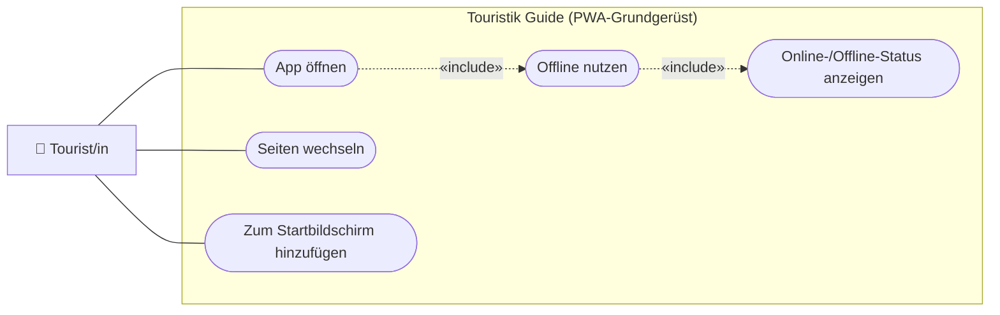

# USERSTORY.md — Nutzeranforderungen: 00-foundation (App-Grundgerüst)

> **Hinweis:** Konkretes Feature der LB3-Beispiel-PWA „Touristik Guide" (Stufe **A**).
> Das Grundgerüst ist die Basis aller weiteren Features (`01`–`06`). LB3-Aufgaben: **A1–A5**.
> Für ein *eigenes* Projekt dient dieses Feature als Vorbild — Struktur übernehmen,
> Inhalte ersetzen.

---

## Story 1 — App öffnen und navigieren

**Als** Tourist/in
**möchte ich** die App öffnen und zwischen Startseite und Inhalten wechseln können
**damit** ich mich auf Anhieb zurechtfinde, ohne die Seite neu zu laden.

### Abnahmekriterien

- Beim Start ist die Startseite (`#page1`) sichtbar, andere Seiten sind ausgeblendet
- Ein Klick/Tap auf „Zu den Attraktionen" wechselt zur Listenseite (`#page2`)
- Der Seitenwechsel funktioniert auch über die URL (`#page2`) und den Zurück-Button des Browsers
- Header (Logo → Startseite) und Footer werden auf jeder Seite angezeigt

---

## Story 2 — Offline nutzbar und Status sichtbar

**Als** Tourist/in vor Ort (oft schlechtes Netz)
**möchte ich** die App auch ohne Verbindung öffnen und sehen, ob ich online bin
**damit** ich mich auf die App verlassen kann, auch wenn das Netz wegbricht.

### Abnahmekriterien

- Nach dem ersten Laden startet die App auch offline (Grundgerüst + Bulma + Logo + Manifest aus dem Cache)
- Eine Statusanzeige zeigt `online` bzw. `offline` und aktualisiert sich beim Wechsel
- Angeforderte Ressourcen werden zuerst aus dem Cache beantwortet (cache-first), sonst aus dem Netz
- Bei Netzfehler scheitert die App nicht hart (kein weißer Bildschirm)

---

## Story 3 — Installierbar (Add to Homescreen)

**Als** Tourist/in
**möchte ich** die App zum Startbildschirm hinzufügen können
**damit** sie sich wie eine native App öffnet (Vollbild, eigenes Icon).

### Abnahmekriterien

- Ein gültiges `manifest.json` (Name, Icons 48/96/192, `display: standalone`) ist eingebunden
- Der Browser bietet „Zum Startbildschirm hinzufügen" an
- Nach der Installation startet die App im Standalone-Modus über `start_url`

---

## UseCase-Diagramm (UCD)

> Konvention + Legende: [`docs/diagramme.md`](../../docs/diagramme.md) (Abschnitt 1).
> Mermaid hat keinen nativen UCD-Typ — wir bilden ihn als `flowchart` nach.

---

> **Tipp:** Das Grundgerüst ist kein „sichtbares" Feature wie eine Suche — aber ohne
> stabile, offline-fähige Basis tragen die späteren Features (`01`–`06`) nicht.
> Diagramm vom KI-Agenten erzeugen lassen: *„Erzeuge ein Mermaid-UCD nach
> `docs/diagramme.md` für die Stories in dieser Datei."*
