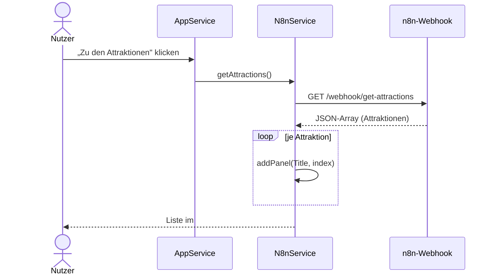

# IMPLEMENTATION.md — Feature 01: Attraktionen laden

> **Für den KI-Agenten:** Schritt für Schritt abarbeiten, jeden Schritt mit `[x]` abhaken,
> am Ende `BACKLOG.md` aktualisieren.

**Ziel:** Attraktionen aus n8n als Liste anzeigen und Detailseite öffnen.
**Abhängigkeit:** 00-foundation abgeschlossen
**Verantwortlich:** [Name]
**Branch:** `feature/01-attraktionen-laden`

---

## Technische Übersicht

**Datei:** `assets/js/n8n.js` (`N8nService`) — Marker **B2**, **B3**, **B4**.
**Backend:** n8n-Webhook (Low-Code), Endpunkt `get-attractions` liefert JSON-Array.
**Lokal starten & prüfen:** [`docs/setup.md`](../../docs/setup.md) → „App lokal starten & prüfen" (Live Server, DevTools). Kein npm/Test-Runner — Prüfung im Browser.

**Ablauf `getAttractions` als Sequenzdiagramm (Mermaid):** Konvention → [`docs/diagramme.md`](../../docs/diagramme.md) Abschnitt 5.

---

## Task 1: B2 — `CONFIG` anpassen

**Auftrag (Original-Marker):** „CONFIG an eigenen n8n Workflow anpassen."

- [ ] `CONFIG.baseUrl` auf die eigene n8n-Webhook-URL setzen; `endpoints` (u. a. `getAttractions`) auf die eigenen Workflow-Pfade anpassen.
- [ ] **Prüfen:** URL im Browser/DevTools-Network aufrufbar (liefert JSON), kein CORS-Fehler.
- [ ] **Commit:** `git commit -m "feat(attraktionen): B2 n8n-CONFIG angepasst"`

---

## Task 2: B3 — `addPanel(text, id)`

**Auftrag (Original-Marker):** „addPanel erzeugen: Hyperlink erstellen + anfügen + Attribute & Klassen setzen."

- [ ] Button (Bulma: `panel-block button is-fullwidth`) mit `textContent = text` erzeugen.
- [ ] Falls `id !== "dontLink"`: `id` setzen und Klick-Listener (`AppService.getConfig().clickEvent`) → `N8nService.toDetailPage(id)`.
- [ ] An `#panelWrapper` anhängen.
- [ ] **Prüfen:** Ein Test-Aufruf `addPanel("Test", "dontLink")` erzeugt einen sichtbaren, nicht-verlinkten Eintrag.
- [ ] **Commit:** `git commit -m "feat(attraktionen): B3 addPanel"`

---

## Task 3: B4 — `getAttractions()`

**Auftrag (Original-Marker):** „getAttractions: Attraktionen von n8n abrufen und in Panel eintragen."

- [ ] `fetch` (GET) auf `CONFIG.baseUrl + CONFIG.endpoints.getAttractions`, `response.ok` prüfen.
- [ ] JSON in `dbResponse` schreiben; über alle Einträge `addPanel(record.Title, index)` aufrufen.
- [ ] Im `catch`: `addPanel("n8n Verbindung fehlgeschlagen", "dontLink")` (kein stiller Fehler).
- [ ] **Prüfen (Browser):** „Zu den Attraktionen" klicken → Liste erscheint; Netzwerk in DevTools zeigt den GET; Detailseite per Klick öffnet sich (`toDetailPage`).
- [ ] **Commit:** `git commit -m "feat(attraktionen): B4 getAttractions"`

---

## Abschluss

- [ ] Marker B2–B4 umgesetzt, keine `console.log("ToDo: …")`-Stubs offen
- [ ] Abnahmekriterien aus `FEATURE.md` im Browser geprüft
- [ ] `BACKLOG.md`: `01-attraktionen-laden` → `✅ fertig`
- [ ] Pull Request anlegen (`git push origin feature/01-attraktionen-laden`)
