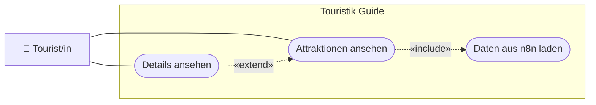

# USERSTORY.md — Nutzeranforderungen: 01-attraktionen-laden

> **Hinweis:** Konkretes LB3-Feature der „Touristik Guide"-PWA (Stufe **B**).
> LB3-Aufgaben: **B2, B3, B4**. Datei: `assets/js/n8n.js` (`N8nService`).

---

## Story 1 — Attraktionen als Liste sehen

**Als** Tourist/in
**möchte ich** eine Liste der verfügbaren Sehenswürdigkeiten sehen
**damit** ich einen Überblick bekomme, was es in der Umgebung gibt.

### Abnahmekriterien

- Ein Klick auf „Zu den Attraktionen" lädt die Daten und zeigt je Attraktion einen Listeneintrag
- Die Daten kommen von einem **n8n-Webhook** (nicht fest verdrahtet)
- Bei fehlender Verbindung erscheint ein sichtbarer Hinweis („n8n Verbindung fehlgeschlagen") statt eines leeren Bildschirms

---

## Story 2 — Details einer Attraktion ansehen

**Als** Tourist/in
**möchte ich** einen Listeneintrag antippen und Details sehen (Beschreibung, Adresse, Telefon, E-Mail)
**damit** ich mehr über eine Sehenswürdigkeit erfahre.

### Abnahmekriterien

- Ein Tap auf einen Eintrag öffnet die Detailseite mit Titel, Beschreibung und Kontaktdaten
- Telefon (`tel:`) und E-Mail (`mailto:`) sind als Links nutzbar
- Der gewählte Eintrag wird gemerkt (für Karte/Foto in späteren Features)

---

## UseCase-Diagramm (UCD)

> Konvention: [`docs/diagramme.md`](../../docs/diagramme.md) (Abschnitt 1).

---

> **Tipp:** Das Backend ist ein **n8n-Workflow** (Low-Code) — der Webhook liefert die
> Attraktionen als JSON. Kein eigener Server nötig.
