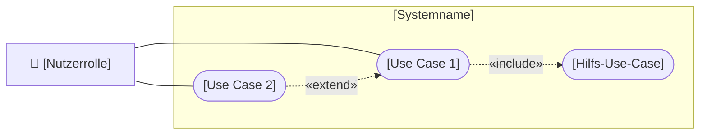

# USERSTORY.md — Nutzeranforderungen: [Featurename]

> **Hinweis:** Dies ist ein Beispiel-Feature zur Orientierung.  
> Benennt Datei und Ordner entsprechend eurem echten Feature.  
> Schema: `requirements/01-euer-feature/USERSTORY.md`

---

## Story 1 — [Kernfunktion]

**Als** [Nutzerrolle, z.B. „Studierende/r"]  
**möchte ich** [konkrete Aktion, z.B. „einen freien Seminarraum suchen können"]  
**damit** [Nutzen/Ziel, z.B. „ich spontan einen ruhigen Arbeitsplatz finde, ohne durch das Gebäude zu laufen"].

### Abnahmekriterien

- Eingabe von [Mindestangabe, z.B. „Datum und Uhrzeit"] zeigt verfügbare Ergebnisse
- Ergebnisse zeigen [welche Informationen?, z.B. „Raumnummer, Kapazität, Ausstattung"]
- [Weiteres Kriterium]
- [Grenzfall: Was passiert, wenn kein Ergebnis vorliegt?]

---

## Story 2 — [Zweite Funktion]

**Als** [Nutzerrolle]  
**möchte ich** [Aktion]  
**damit** [Nutzen].

### Abnahmekriterien

- [Kriterium]
- [Kriterium]
- [Kriterium]

---

## Story 3 — [Dritte Funktion, optional]

**Als** [Nutzerrolle]  
**möchte ich** [Aktion]  
**damit** [Nutzen].

### Abnahmekriterien

- [Kriterium]
- [Kriterium]

---

## UseCase-Diagramm (UCD)

> Überblick: welche Akteure nutzen welche Use Cases. Konvention + Legende:
> [`docs/diagramme.md`](../../docs/diagramme.md) (Abschnitt 1). Mermaid hat keinen nativen
> UCD-Typ — wir bilden ihn als `flowchart` nach (Akteur `👤`, Use Case in Stadion-Form,
> `«include»`/`«extend»` als gestrichelte Pfeile).

> **Tipp:** Diagramm vom KI-Agenten erzeugen lassen, z. B.: *„Erzeuge ein Mermaid-UCD nach
> `docs/diagramme.md` für die Stories in dieser Datei."*

---

> **Tipp:** Nutzeranforderungen müssen konkret genug sein, um daraus Abnahmekriterien abzuleiten.  
> „Die App soll gut funktionieren" ist keine Anforderung.  
> „Als Studierende/r möchte ich sehen, wie viele Plätze noch frei sind, damit ich weiß ob die Veranstaltung zugänglich ist" — das ist eine Anforderung.
