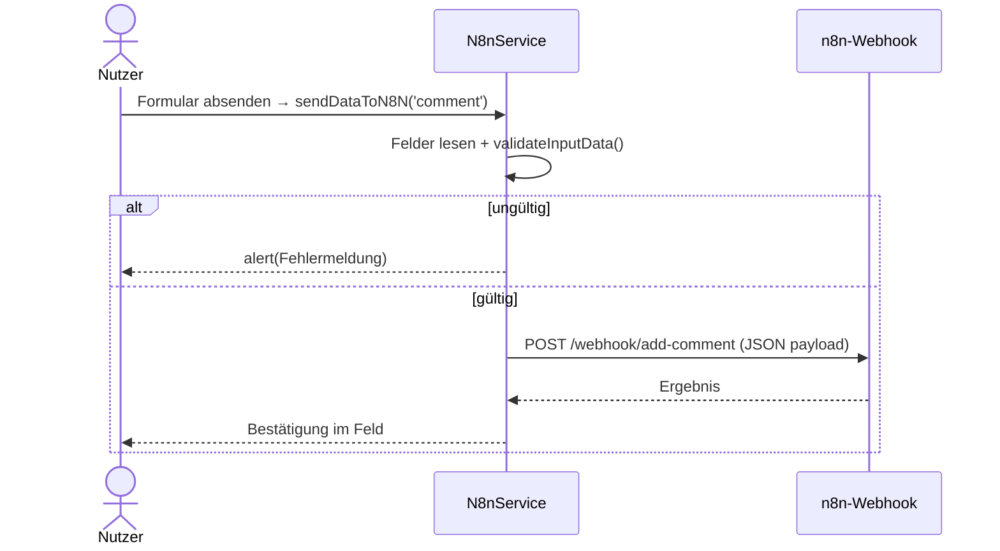

# IMPLEMENTATION.md — Feature 02: Bewertung senden

> **Für den KI-Agenten:** Schritt für Schritt abarbeiten, `[x]` abhaken, am Ende `BACKLOG.md` aktualisieren.

**Ziel:** Validiertes Feedback per `sendDataToN8N` an einen n8n-Webhook senden.
**Abhängigkeit:** 01-attraktionen-laden abgeschlossen (gemeinsames `N8nService`/`CONFIG`)
**Verantwortlich:** [Name]
**Branch:** `feature/02-bewertung-senden`

---

## Technische Übersicht

**Datei:** `assets/js/n8n.js` (`N8nService.sendDataToN8N`) — Marker **B5** (+ optional **D1–D4**).
Hilfsfunktionen bereits vorhanden: `validateInputData`, `fetchWithTimeout`.
**Lokal prüfen:** Browser + DevTools (Network zeigt POST), siehe [`docs/setup.md`](../../docs/setup.md).

**Ablauf als Sequenzdiagramm (Mermaid):** Konvention → [`docs/diagramme.md`](../../docs/diagramme.md) Abschnitt 5.

---

## Task 1: B5 — `sendDataToN8N('comment')` (Kern)

**Auftrag (Original-Marker):** „sendDataToN8N erzeugen: Workflow aufrufen und payload mitgeben."

- [ ] Felder je Typ auslesen (`comment` → `contactName`, `contactComment`).
- [ ] Mit `validateInputData(val1, val2)` prüfen; bei Fehler `alert(...)` und abbrechen.
- [ ] `payload` bauen (`{ name, note }`) und per `fetchWithTimeout` (POST, JSON) an `CONFIG.baseUrl + CONFIG.endpoints.addComment` senden; `response.ok` prüfen.
- [ ] Bei Erfolg Felder mit Bestätigungstext überschreiben; Fehler im `catch` mit `alert` + Konsole.
- [ ] **Prüfen (Browser):** Formular abschicken → DevTools-Network zeigt POST 200; leeres Feld → Fehlermeldung.
- [ ] **Commit:** `git commit -m "feat(bewertung): B5 sendDataToN8N (comment)"`

---

## Task 2 *(optional)*: D1–D4 — weitere Typen

> Nur bearbeiten, wenn im Team vereinbart. Baut auf Task 1 auf.

- [ ] **D1–D3:** Typen `email`, `attraction`, `chat` ergänzen (Feld-IDs, Endpunkt, Payload je `type` im `switch`).
- [ ] **D4:** Bei `type === 'email'` nach Erfolg `showServiceWorkerNotification(...)` aufrufen (Push).
- [ ] **Prüfen:** je Typ ein Durchlauf; Push erscheint bei `email`.
- [ ] **Commit:** `git commit -m "feat(bewertung): D1-D4 weitere Sende-Typen (optional)"`

---

## Abschluss

- [ ] Marker B5 (und ggf. D1–D4) umgesetzt, keine offenen `console.log("ToDo: …")`
- [ ] Abnahmekriterien aus `FEATURE.md` im Browser geprüft
- [ ] `BACKLOG.md`: `02-bewertung-senden` → `✅ fertig`
- [ ] Pull Request anlegen (`git push origin feature/02-bewertung-senden`)
