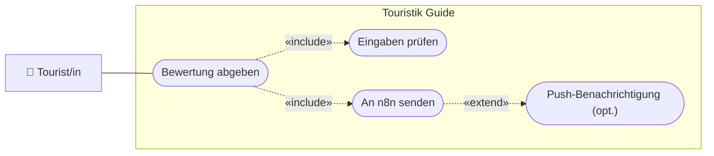

# USERSTORY.md — Nutzeranforderungen: 02-bewertung-senden

> **Hinweis:** Konkretes LB3-Feature (Stufe **B**). LB3-Aufgabe: **B5** (+ optional **D1–D4**).
> Datei: `assets/js/n8n.js` (`N8nService.sendDataToN8N`).

---

## Story 1 — Bewertung/Kommentar abgeben

**Als** Tourist/in
**möchte ich** über ein Formular eine Bewertung bzw. einen Kommentar abschicken
**damit** der Betreiber mein Feedback erhält.

### Abnahmekriterien

- Ein Formular (Name + Kommentar) sendet die Daten an einen n8n-Webhook
- Leere/zu kurze Eingaben werden abgefangen und mit einer klaren Meldung quittiert
- Nach Erfolg erscheint eine Bestätigung im UI

---

## Story 2 *(optional, D1–D4)* — Weitere Sende-Typen

**Als** Tourist/in bzw. Betreiber
**möchte ich** optional auch E-Mail-Benachrichtigung, neue Attraktion oder Chat nutzen
**damit** dieselbe Sende-Logik mehrere Zwecke abdeckt.

### Abnahmekriterien

- `sendDataToN8N(type)` unterstützt `comment` (Kern) sowie optional `email`, `attraction`, `chat`
- Bei `email` wird zusätzlich eine ServiceWorker-Push-Benachrichtigung angezeigt (D4)

---

## UseCase-Diagramm (UCD)

> Konvention: [`docs/diagramme.md`](../../docs/diagramme.md) (Abschnitt 1).

---

> **Tipp:** `sendDataToN8N` ist bewusst **eine** Funktion mit `type`-Parameter — ein gutes
> Beispiel gegen Duplikat-Code (vgl. Qualitätsstandards in `CLAUDE.md`).
