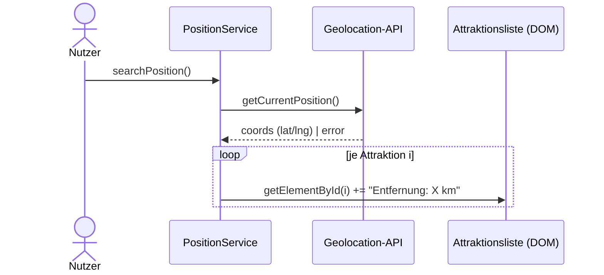

# IMPLEMENTATION.md — Feature 03: Standort

> **Für den KI-Agenten:** Schritt für Schritt abarbeiten, `[x]` abhaken, am Ende `BACKLOG.md` aktualisieren.

**Ziel:** Aktuelle Position bestimmen und je Attraktion die Entfernung anzeigen.
**Abhängigkeit:** 01-attraktionen-laden abgeschlossen
**Verantwortlich:** [Name]
**Branch:** `feature/03-standort`

---

## Technische Übersicht

**Datei:** `assets/js/position.js` (`PositionService`) — Marker **C1**, **C2** (Lernaufgabe), **C3**.
**Voraussetzung:** Geolocation braucht **secure context** (`http://localhost`, nicht `file://`).
**Prüfen:** Browser + DevTools; Position ggf. über *Sensors* emulieren. Siehe [`docs/setup.md`](../../docs/setup.md).

---

## Task 1: C1 — `searchPosition()`

**Auftrag (Original-Marker):** „Position mittels Geolocation API bestimmen."

- [ ] Prüfen ob `navigator.geolocation` vorhanden; dann `getCurrentPosition(distToLocation, handleError)`.
- [ ] Sonst Konsolenmeldung „Geolocation wird vom Browser nicht unterstuetzt".
- [ ] **Prüfen:** Aufruf löst die Browser-Berechtigungsabfrage aus; bei „Ablehnen" greift `handleError`.
- [ ] **Commit:** `git commit -m "feat(standort): C1 searchPosition"`

---

## Task 2: C2 — Distanzberechnung erklären *(Lernaufgabe, kein Code)*

**Auftrag (Original-Marker):** „distToLocation erklären lassen."

- [ ] `distToLocation` vom KI-Agenten erklären lassen: Näherung `dx = 71.5·Δlng`, `dy = 111.3·Δlat`, `distance = √(dx²+dy²)`.
- [ ] Grenzen benennen (keine Erdkrümmung; Haversine wäre exakter). Kurznotiz im PR/README.
- [ ] **Commit:** entfällt (keine Codeänderung) — Erkenntnis im PR-Text festhalten.

---

## Task 3: C3 — Entfernung ausgeben

**Auftrag (Original-Marker):** „Entfernung im HTML Element mit der ID = i ausgeben."

- [ ] In der `forEach`-Schleife von `distToLocation`: `const element = document.getElementById(i)`; falls vorhanden `element.innerHTML += \` - Entfernung: ${km} km\``.
- [ ] **Prüfen (Browser):** Liste laden → je Eintrag steht die Entfernung; `localStorage` enthält `currentLat`/`currentLng`.
- [ ] **Commit:** `git commit -m "feat(standort): C3 Entfernung je Attraktion"`

---

## Abschluss

- [ ] Marker C1/C3 umgesetzt, C2 erklärt; keine offenen `console.log("ToDo: …")`
- [ ] Abnahmekriterien aus `FEATURE.md` im Browser geprüft
- [ ] `BACKLOG.md`: `03-standort` → `✅ fertig`
- [ ] Pull Request anlegen (`git push origin feature/03-standort`)
