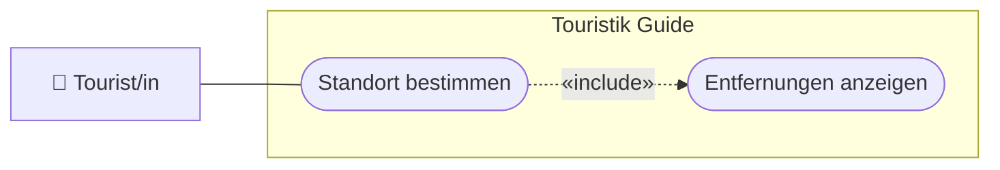

# USERSTORY.md — Nutzeranforderungen: 03-standort

> **Hinweis:** Konkretes LB3-Feature (Stufe **C**). LB3-Aufgaben: **C1, C2, C3**.
> Datei: `assets/js/position.js` (`PositionService`).

---

## Story 1 — Entfernung zu Attraktionen sehen

**Als** Tourist/in vor Ort
**möchte ich** je Attraktion die Entfernung zu meinem Standort sehen
**damit** ich erkenne, was in der Nähe ist.

### Abnahmekriterien

- Nach dem Laden der Liste wird meine Position per Geolocation bestimmt (mit Berechtigungsabfrage)
- Bei jedem Listeneintrag erscheint die Entfernung in km
- Wird die Berechtigung verweigert / ist Geolocation nicht verfügbar, erscheint eine Meldung (kein Absturz)

---

## Story 2 *(Lernaufgabe C2)* — Distanzberechnung verstehen

**Als** Studierende/r
**möchte ich** die Funktion `distToLocation` erklärt bekommen
**damit** ich die Näherungsformel (Pythagoras auf Lat/Lng) nachvollziehe.

### Abnahmekriterien

- Die Näherung (`71.5 * Δlng`, `111.3 * Δlat`) ist im Team erklärbar
- Grenzen der Näherung (keine Erdkrümmung/Haversine) sind benannt

---

## UseCase-Diagramm (UCD)

> Konvention: [`docs/diagramme.md`](../../docs/diagramme.md) (Abschnitt 1).

---

> **Tipp:** Geolocation braucht einen **secure context** — lokal über `http://localhost`
> (Live Server), nicht `file://`. Siehe [`docs/setup.md`](../../docs/setup.md).
