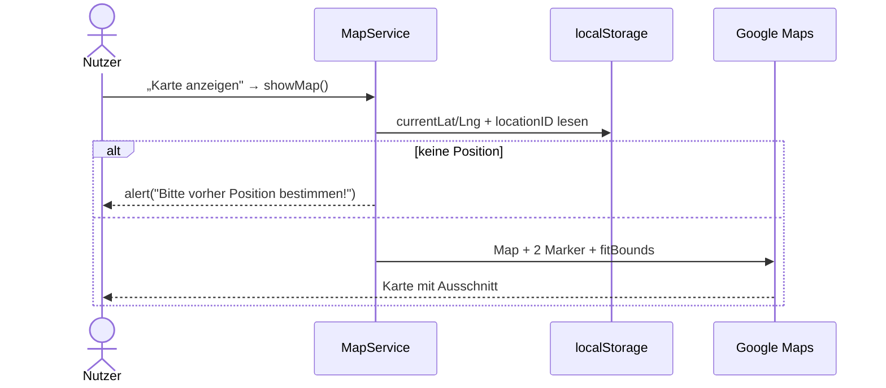

# IMPLEMENTATION.md — Feature 04: Karte

> **Für den KI-Agenten:** Schritt für Schritt abarbeiten, `[x]` abhaken, am Ende `BACKLOG.md` aktualisieren.

**Ziel:** Position + gewählte Attraktion auf einer Google-Karte anzeigen.
**Abhängigkeit:** 03-standort (Position im localStorage) + 01-attraktionen-laden (Detailseite)
**Verantwortlich:** [Name]
**Branch:** `feature/04-karte`

---

## Technische Übersicht

**Datei:** `assets/js/map.js` (`MapService.showMap`) — Marker **C4**, **C5** *(optional)*.
**Voraussetzung:** Google-Maps-API-Key eingebunden; `currentLat`/`currentLng` aus `03-standort`.
**Prüfen:** Browser (Karte lädt, Marker sichtbar), siehe [`docs/setup.md`](../../docs/setup.md).

---

## Task 1: C4 — `showMap()` (Karte + Marker + Ausschnitt)

**Auftrag (Original-Marker):** „showMap vervollständigen: Karte einzeichnen, Marker setzen, Kartenausschnitt eingrenzen."

- [ ] Position-Guard: wenn `localStorage.getItem('currentLat') === null` → `alert('Bitte vorher Position bestimmen!')` + `return`.
- [ ] `new google.maps.Map(document.getElementById('mapOutput'))`.
- [ ] Zwei `google.maps.Marker` (aktuelle Position, Attraktion aus `N8nService.getResponse()[locationID]`).
- [ ] `LatLngBounds` mit beiden Punkten `extend`, dann `map.fitBounds(bounds)`.
- [ ] **Prüfen (Browser):** Detailseite → „Karte anzeigen" → Karte mit beiden Markern, Ausschnitt passt.
- [ ] **Commit:** `git commit -m "feat(karte): C4 showMap"`

---

## Task 2 *(optional)*: C5 — Adresse via Geocoder

**Auftrag (Original-Marker):** „Postalische Adresse der aktuellen Pos. ermitteln und darstellen."

- [ ] `new google.maps.Geocoder()`; `geocode({ latLng: currentPosition }, ...)`.
- [ ] Bei `GeocoderStatus.OK` `results[0].formatted_address` in `#adressOutput` schreiben.
- [ ] **Prüfen:** Adresse erscheint unter der Karte.
- [ ] **Commit:** `git commit -m "feat(karte): C5 Adresse via Geocoder (optional)"`

---

## Abschluss

- [ ] Marker C4 (und ggf. C5) umgesetzt
- [ ] Abnahmekriterien aus `FEATURE.md` im Browser geprüft (inkl. Position-Guard)
- [ ] `BACKLOG.md`: `04-karte` → `✅ fertig`
- [ ] Pull Request anlegen (`git push origin feature/04-karte`)
