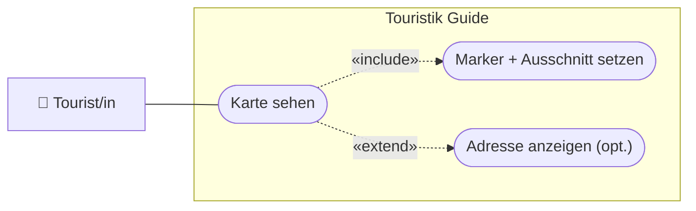

# USERSTORY.md — Nutzeranforderungen: 04-karte

> **Hinweis:** Konkretes LB3-Feature (Stufe **C**). LB3-Aufgaben: **C4, C5** *(optional)*.
> Datei: `assets/js/map.js` (`MapService`).

---

## Story 1 — Attraktion auf der Karte sehen

**Als** Tourist/in
**möchte ich** die gewählte Attraktion und meinen Standort auf einer Karte sehen
**damit** ich den Weg dorthin einschätzen kann.

### Abnahmekriterien

- Auf der Detailseite öffnet „Karte anzeigen" eine Karte mit zwei Markern (eigene Position + Attraktion)
- Der Kartenausschnitt umfasst beide Punkte (`fitBounds`)
- Ist noch keine Position bestimmt, erscheint der Hinweis „Bitte vorher Position bestimmen!"

---

## Story 2 *(optional, C5)* — Eigene Adresse anzeigen

**Als** Tourist/in
**möchte ich** meine aktuelle postalische Adresse sehen
**damit** ich weiß, wo ich gerade bin.

### Abnahmekriterien

- Über Reverse-Geocoding wird die Adresse der aktuellen Position ermittelt und angezeigt

---

## UseCase-Diagramm (UCD)

> Konvention: [`docs/diagramme.md`](../../docs/diagramme.md) (Abschnitt 1).

---

> **Tipp:** Braucht einen **Google-Maps-API-Key** und eine bestimmte Position aus
> `03-standort` (`currentLat`/`currentLng` im `localStorage`).
