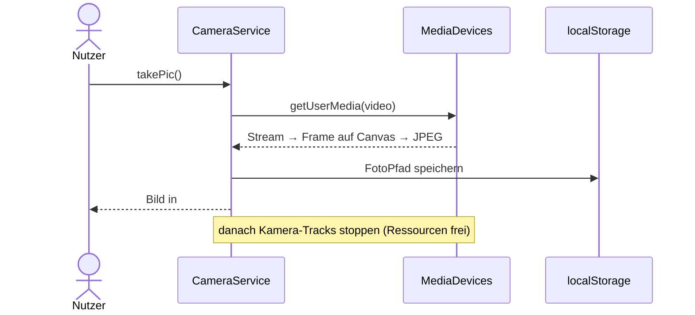

# IMPLEMENTATION.md — Feature 05: Foto

> **Für den KI-Agenten:** Schritt für Schritt abarbeiten, `[x]` abhaken, am Ende `BACKLOG.md` aktualisieren.

**Ziel:** Foto aufnehmen, anzeigen und zuletzt aufgenommenes Bild wieder laden.
**Abhängigkeit:** 01-attraktionen-laden (Detailseite) — technisch unabhängig von 03/04
**Verantwortlich:** [Name]
**Branch:** `feature/05-foto`

---

## Technische Übersicht

**Datei:** `assets/js/camera.js` (`CameraService`) — Marker **C7** (`takePic`), **C8** (`loadPic`).
**Voraussetzung:** `getUserMedia` braucht secure context (`http://localhost`) + Kamera-Freigabe.
**Prüfen:** Browser mit Kamera; siehe [`docs/setup.md`](../../docs/setup.md).

---

## Task 1: C7 — `takePic()`

**Auftrag (Original-Marker):** „Funktion um auf Kamera zuzugreifen und Bild auf Seite darzustellen."

- [ ] `navigator.mediaDevices.getUserMedia(SETTINGS)` → Stream in ein temporäres `<video>`.
- [ ] Nach `onloadedmetadata` einen Frame auf ein `canvas` zeichnen; `toDataURL`/`toBlob` → JPEG.
- [ ] Bild in `#picOutput` anzeigen (`is-hidden` entfernen), Pfad in `localStorage` (`FotoPfad`).
- [ ] Ressourcen freigeben (`releaseMediaResources`) — auch im `catch`; bei Fehler `alert(...)`.
- [ ] **Prüfen (Browser):** Auslösen → Berechtigungsabfrage → Bild erscheint; in DevTools sind die Kamera-Tracks danach gestoppt.
- [ ] **Commit:** `git commit -m "feat(foto): C7 takePic"`

---

## Task 2: C8 — `loadPic()`

**Auftrag (Original-Marker):** „lade sofern vorhanden ein Bild aus dem localStorage und zeige es an."

- [ ] `localStorage.getItem('FotoPfad')` lesen; falls vorhanden `#picOutput.src` setzen und anzeigen.
- [ ] **Prüfen:** Nach Aufnahme Seite neu laden/öffnen → letztes Foto erscheint.
- [ ] **Commit:** `git commit -m "feat(foto): C8 loadPic"`

---

## Abschluss

- [ ] Marker C7/C8 umgesetzt, keine offenen `console.log("ToDo: …")`
- [ ] Abnahmekriterien aus `FEATURE.md` im Browser geprüft (inkl. Ressourcenfreigabe)
- [ ] `BACKLOG.md`: `05-foto` → `✅ fertig`
- [ ] Pull Request anlegen (`git push origin feature/05-foto`)
