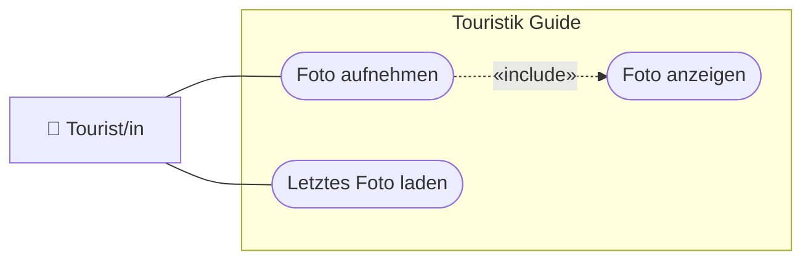

# USERSTORY.md — Nutzeranforderungen: 05-foto

> **Hinweis:** Konkretes LB3-Feature (Stufe **C**). LB3-Aufgaben: **C7, C8**.
> Datei: `assets/js/camera.js` (`CameraService`).

---

## Story 1 — Foto aufnehmen

**Als** Tourist/in
**möchte ich** mit der Kamera ein Foto aufnehmen und angezeigt bekommen
**damit** ich einen Moment zur Attraktion festhalten kann.

### Abnahmekriterien

- Ein Auslöser startet die Kamera (mit Berechtigungsabfrage) und nimmt ein Bild auf
- Das aufgenommene Bild wird in `#picOutput` angezeigt
- Kamera-Ressourcen werden nach der Aufnahme wieder freigegeben (kein Dauer-Zugriff)
- Ohne Kamerazugriff erscheint eine verständliche Meldung

---

## Story 2 — Zuletzt aufgenommenes Foto wiedersehen

**Als** Tourist/in
**möchte ich** mein zuletzt aufgenommenes Foto beim Öffnen wiedersehen
**damit** es nicht verloren geht.

### Abnahmekriterien

- Ist ein Foto gespeichert, wird es über `loadPic()` erneut in `#picOutput` angezeigt

---

## UseCase-Diagramm (UCD)

> Konvention: [`docs/diagramme.md`](../../docs/diagramme.md) (Abschnitt 1).

---

> **Tipp:** Kamera (`getUserMedia`) braucht **secure context** (`http://localhost`, nicht
> `file://`) und Nutzer-Freigabe. Siehe [`docs/setup.md`](../../docs/setup.md).
