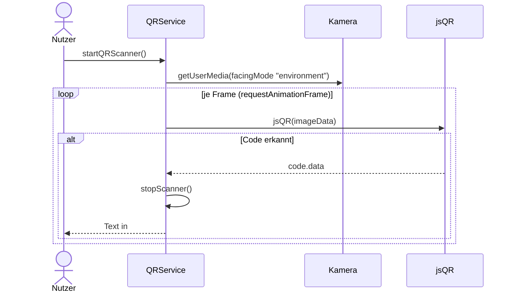

# IMPLEMENTATION.md — Feature 06: QR-Scan

> **Für den KI-Agenten:** Schritt für Schritt abarbeiten, `[x]` abhaken, am Ende `BACKLOG.md` aktualisieren.

**Ziel:** QR-Code per Kamera scannen, Inhalt anzeigen, Kamera sauber freigeben.
**Abhängigkeit:** 01-attraktionen-laden (QR-Seite erreichbar) — technisch unabhängig von 03/04/05
**Verantwortlich:** [Name]
**Branch:** `feature/06-qr-scan`

---

## Technische Übersicht

**Datei:** `assets/js/qr.js` (`QRService`) — Marker **C9** (`startQRScanner`), **C10** (Cleanup).
**Voraussetzung:** `getUserMedia` (secure context) + `jsQR`-Bibliothek eingebunden.
**Prüfen:** Browser mit Kamera + ein Test-QR-Code; siehe [`docs/setup.md`](../../docs/setup.md).

---

## Task 1: C9 — `startQRScanner()` (Kamerazugriff + Scan)

**Auftrag (Original-Marker):** „Kamerazugriff implementieren."

- [ ] `getUserMedia({ video: { facingMode: "environment", … } })`; Stream in `#videoQR`, `playsinline` setzen, `play()`.
- [ ] `scanning = true`; Scan-Loop per `requestAnimationFrame(scan)`; je Frame auf `#canvasQR` zeichnen und `jsQR(imageData.data, w, h)` prüfen.
- [ ] Erkannter Code → `#outputQR.textContent = code.data`, dann `stopScanner()`.
- [ ] Kamerafehler → Meldung in `#outputQR`.
- [ ] **Prüfen (Browser):** Test-QR vor die Kamera → Inhalt erscheint, Scanner stoppt.
- [ ] **Commit:** `git commit -m "feat(qr): C9 startQRScanner"`

---

## Task 2: C10 — Cleanup beim Verlassen

**Auftrag (Original-Marker):** „Event-Handler und Aufräumen beim Verlassen der Seite."

- [ ] `window.addEventListener('beforeunload', () => QRService.stopScanner())`.
- [ ] `stopScanner()` stoppt alle Kamera-Tracks (`getTracks().forEach(track => track.stop())`) und setzt `scanning = false`.
- [ ] **Prüfen:** Seite verlassen/neu laden → Kamera-Indikator erlischt, kein Loop im Hintergrund.
- [ ] **Commit:** `git commit -m "feat(qr): C10 Cleanup/stopScanner"`

---

## Abschluss

- [ ] Marker C9/C10 umgesetzt, keine offenen `console.log("ToDo: …")`
- [ ] Abnahmekriterien aus `FEATURE.md` im Browser geprüft (inkl. Kamera-Freigabe)
- [ ] `BACKLOG.md`: `06-qr-scan` → `✅ fertig`
- [ ] Pull Request anlegen (`git push origin feature/06-qr-scan`)
