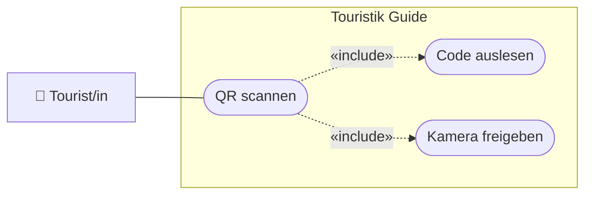

# USERSTORY.md — Nutzeranforderungen: 06-qr-scan

> **Hinweis:** Konkretes LB3-Feature (Stufe **C**). LB3-Aufgaben: **C9, C10**.
> Datei: `assets/js/qr.js` (`QRService`).

---

## Story 1 — QR-Code scannen

**Als** Tourist/in
**möchte ich** einen QR-Code (z. B. am Info-Schild) mit der Kamera scannen
**damit** ich schnell an weiterführende Informationen komme.

### Abnahmekriterien

- Der Scanner nutzt die Rückkamera und zeigt das Live-Bild
- Ein erkannter QR-Code wird als Text ausgegeben (`#outputQR`)
- Nach erfolgreicher Erkennung stoppt der Scanner automatisch

---

## Story 2 — Kamera sauber freigeben

**Als** Nutzer/in
**möchte ich**, dass die Kamera beim Verlassen der Seite freigegeben wird
**damit** kein Kamera-Zugriff im Hintergrund bleibt.

### Abnahmekriterien

- Beim Verlassen/Schließen (`beforeunload`) werden die Kamera-Tracks gestoppt
- Der Scan-Loop endet (kein Weiterlaufen im Hintergrund)

---

## UseCase-Diagramm (UCD)

> Konvention: [`docs/diagramme.md`](../../docs/diagramme.md) (Abschnitt 1).

---

> **Tipp:** Nutzt die Bibliothek **jsQR** und die Rückkamera (`facingMode: "environment"`).
> Kamera braucht secure context (`http://localhost`). Siehe [`docs/setup.md`](../../docs/setup.md).
