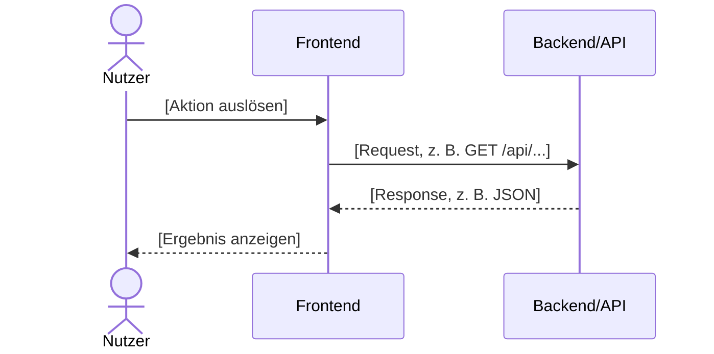

# IMPLEMENTATION.md — Feature NN: [Featurename]

> **Für den KI-Agenten:** Arbeite diese Datei Schritt für Schritt ab.  
> Hake jeden erledigten Schritt mit `[x]` ab.  
> Aktualisiere `BACKLOG.md` wenn alle Aufgaben erledigt sind.  
> Bei Unterbrechung: Die nächste Sitzung beginnt mit dem Lesen dieser Datei — der Stand ist sofort klar.

**Ziel:** [Ein Satz: Was soll am Ende dieser Umsetzung funktionieren?]  
**Abhängigkeit:** 00-foundation abgeschlossen  
**Verantwortlich:** [Name]  
**Branch:** `feature/NN-[name]`

---

## Technische Übersicht

**Betroffene Dateien:**
- Neu anlegen: `[pfad/datei.js]`
- Neu anlegen: `[pfad/datei.test.js]`
- Anpassen: `[pfad/vorhandene-datei.js]` (Zeile ca. [N]: [was ändern?])

**Schnittstelle:**
- Endpunkt: `GET /api/[ressource]?q=[suchbegriff]`
- Rückgabe: `[{ id, name, ... }]`

**Ablauf als Sequenzdiagramm (Mermaid):** Konvention → [`docs/diagramme.md`](../../docs/diagramme.md) Abschnitt 5.



---

## Task 1: Backend — [Beschreibung]

**Dateien:**
- Anlegen: `backend/[modul]/[name].js`
- Test: `backend/tests/[name].test.js`

- [ ] **Schritt 1: Test schreiben (schlägt fehl)**

Datei anlegen: `backend/tests/[name].test.js`

```javascript
// Beispielstruktur — an euren Technologiestack anpassen
import { describe, it, expect } from 'vitest';

describe('[Funktionsname]', () => {
  it('[was soll passieren?]', async () => {
    // Vorbereitung — Testdaten
    const eingabe = '[Testwert]';

    // Ausführung — Funktion aufrufen
    const ergebnis = await meineFunktion(eingabe);

    // Prüfung — Ergebnis prüfen
    expect(ergebnis).toHaveLength(1);
    expect(ergebnis[0].name).toBe('[Erwarteter Wert]');
  });

  it('gibt leeres Array zurück wenn kein Treffer', async () => {
    const ergebnis = await meineFunktion('gibts-nicht-xyz');
    expect(ergebnis).toEqual([]);
  });
});
```

- [ ] **Schritt 2: Test ausführen — Fehler erwarten**

```bash
npm test backend/tests/[name].test.js
# Erwartetes Ergebnis: FAIL (Funktion existiert noch nicht)
```

- [ ] **Schritt 3: Umsetzung**

Datei anlegen: `backend/[modul]/[name].js`

```javascript
export async function meineFunktion(suchbegriff) {
  // Schritt A: Daten laden
  // Schritt B: Filtern
  // Schritt C: Ergebnis zurückgeben
}
```

- [ ] **Schritt 4: Test ausführen — Bestehen erwarten**

```bash
npm test backend/tests/[name].test.js
# Erwartetes Ergebnis: PASS
```

- [ ] **Schritt 5: Commit**

```bash
git add .
git commit -m "feat(backend): [was wurde umgesetzt]"
```

---

## Task 2: API — [Beschreibung]

**Dateien:**
- Anpassen: `backend/routes/[name].js`

- [ ] **Schritt 1: Route registrieren**

```javascript
app.get('/api/[ressource]', async (req, res) => {
  const { q } = req.query;
  if (!q || q.length < 2) {
    return res.status(400).json({ error: 'Mindestens 2 Zeichen erforderlich' });
  }
  const ergebnisse = await meineFunktion(q);
  res.json(ergebnisse);
});
```

- [ ] **Schritt 2: Manueller Test**

```bash
# Server starten:
npm run dev

# Endpunkt testen (in neuem Terminal):
curl "http://localhost:3000/api/[ressource]?q=test"
# Erwartetes Ergebnis: JSON-Array mit Treffern
```

- [ ] **Schritt 3: Commit**

```bash
git commit -m "feat(api): GET /api/[ressource]"
```

---

## Task 3: Frontend — [Beschreibung]

**Dateien:**
- Anlegen: `frontend/src/[component].js`
- Anpassen: `frontend/index.html`

- [ ] **Schritt 1: Komponente erstellen**

```javascript
// frontend/src/[component].js
// [Beispiel für euren Technologiestack]
```

- [ ] **Schritt 2: In index.html einbinden**

```html
<div id="[feature-container]">
  <!-- Komponente hier -->
</div>
```

- [ ] **Schritt 3: Manuell im Browser prüfen**

```
1. Browser öffnen: http://localhost:3000
2. [Schritt A: Was eingeben?]
3. [Schritt B: Was erscheint?]
4. [Grenzfall: Was passiert bei leerem Feld?]
```

- [ ] **Schritt 4: Commit**

```bash
git commit -m "feat(frontend): [was wurde gebaut]"
```

---

## Abschluss

- [ ] Alle Tests bestehen: `npm test`
- [ ] Manuelle Prüfung: Abnahmekriterien aus `FEATURE.md` durchgehen
- [ ] `BACKLOG.md` aktualisieren: Status auf `✅ fertig` setzen
- [ ] Pull Request auf GitHub anlegen

```bash
git push origin feature/NN-[name]
# → GitHub öffnen → „Compare & pull request" → Teamkollegen als Reviewer zuweisen
```
